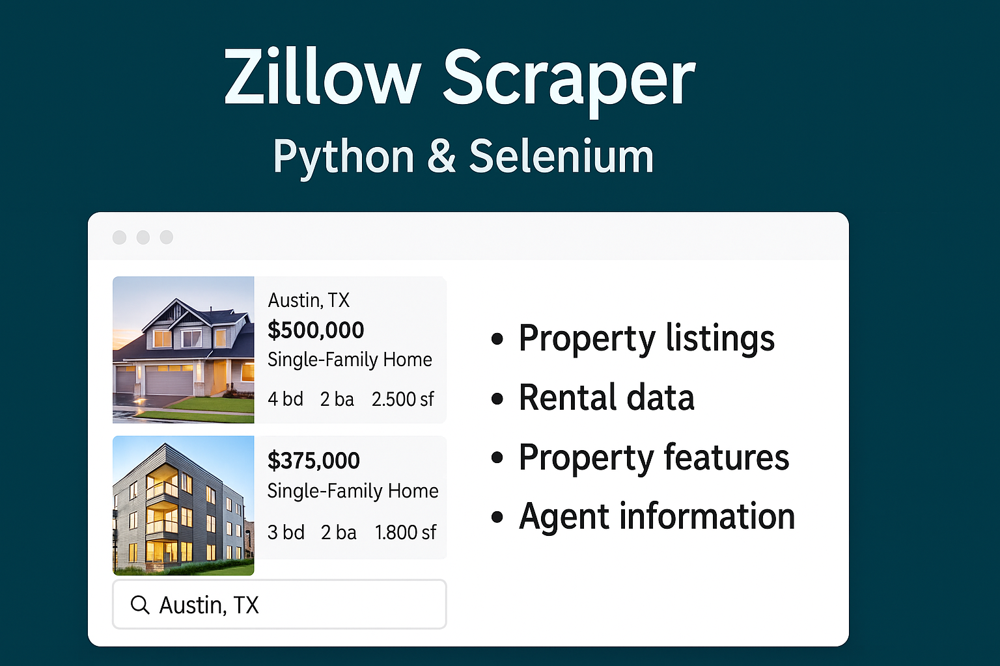
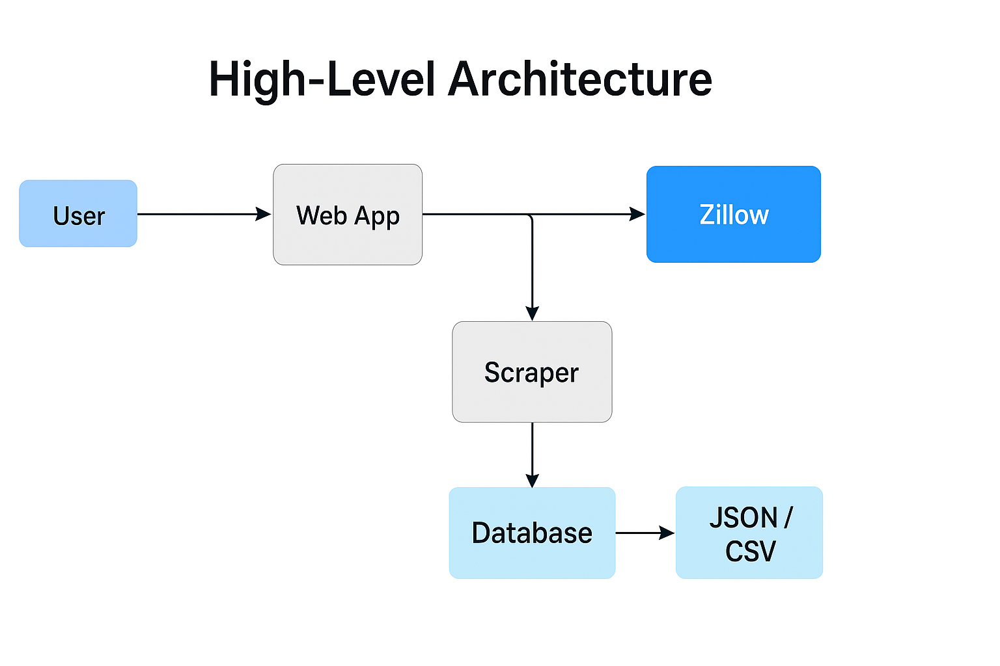

# Zillow Scraper – Python & Selenium

  
  
  

>Open-source Zillow scraper built with Python and Selenium to extract property listings, rental data, prices, home details, and agent information. Automates real estate data collection into structured JSON/CSV for analysis, investment research, and market insights.

  

---

## Introduction
The **Zillow Scraper** is an open-source tool built with **Python + Selenium** to extract:
- :white_check_mark: Property listings (addresses, prices, details)
- :white_check_mark: Rental data
- :white_check_mark: Property features (bedrooms, bathrooms, square footage)
- :white_check_mark: Agent information
This scraper automates Zillow browsing and delivers **structured JSON/CSV outputs** ready for real estate analysis, investment research, and dashboards.

---

## Features
| Feature               | Description                                     |
|------------------------|-------------------------------------------------|
| Property Listings      | Extract address, price, square footage, etc.   |
| Rental Data            | Collect rental listings & prices               |
| Agent Details          | Extract agent/agency info                      |
| Human-Like Automation  | Random delays, scrolling & interaction patterns |
| Scalability            | Scrape hundreds or thousands of listings safely |
---

  

## Architecture

  

---
## :package: Installation

